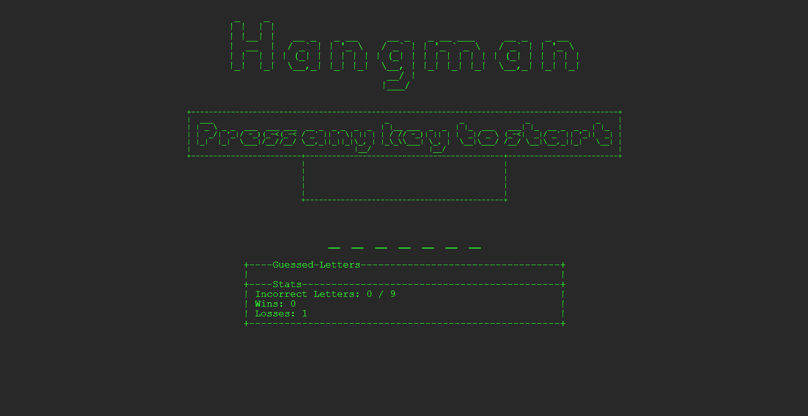

# [Hangman-Game](https://the-realest-stu.github.io/Hangman-Game/)

### Project Description
This is a simple hangman game with an old-school terminal theme. It was written in Javascript, without any libraries or APIs (not even jQuery). To play, just guess a letter by typing your guess on your keyboard. If you guess incorrectly 9 times, you lose. If you guess the word before that happens, you win. After you win or lose, you can restart the game by pressing any key on the keyboard.

